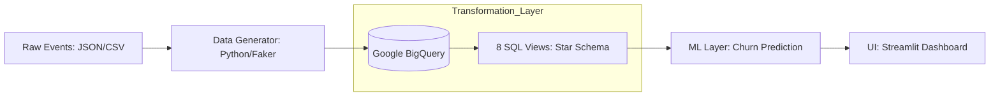
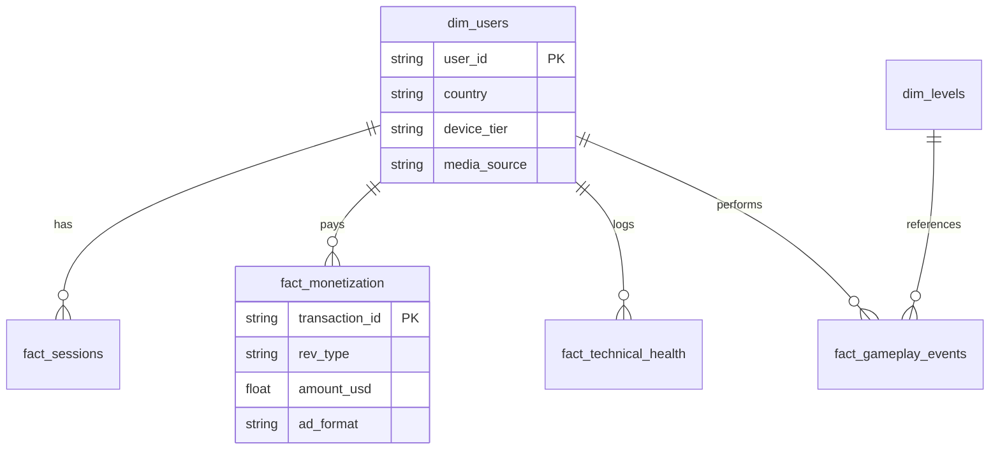

# 🎮 Mobile Game Analytics Portal: End-to-End ELT Pipeline

## 📌 1. Tổng quan dự án (Project Overview)

Dự án này xây dựng một hệ thống phân tích dữ liệu toàn diện cho một tựa game mobile phát hành trên quy mô **10 quốc gia**. Hệ thống mô phỏng trọn vẹn quy trình của một **Data Analyst** thực thụ: từ việc thiết kế kịch bản log (Event Tracking), xây dựng kho dữ liệu (Data Warehouse), cho đến việc đưa ra các phân tích **Chẩn đoán (Diagnostic)** và **Dự báo (Predictive)** nhằm tối ưu hóa sản phẩm.

## 🏗 2. Kiến trúc hệ thống (Architecture)

Hệ thống tuân thủ mô hình **ELT (Extract - Load - Transform)** để đảm bảo tính linh hoạt và khả năng mở rộng:



## 🧠 3. Actionable Insights: Beyond Descriptive

Dự án tập trung vào việc chuyển hóa dữ liệu thành hành động thông qua hai cấp độ phân tích nâng cao:

### 🔍 Phân tích Chẩn đoán (Diagnostic Analytics) - *Tại sao điều đó xảy ra?*

* **TikTok Drop-off:** Mặc dù TikTok có CPI thấp nhất, nhưng Retention D1 thấp hơn 20% so với Organic.
* **Phát hiện:** `duration_sec` phiên đầu của user TikTok cực thấp.
* **Kết luận:** Sai lệch kỳ vọng giữa nội dung quảng cáo (Creative) và gameplay thực tế.


* **Level 3 Choke-point:** Tỷ lệ hoàn thành Level 3 chỉ đạt 40%.
* **Phát hiện:** 80% `fail_reason` là "Out of time".
* **Kết luận:** Chỉ số `difficulty_index` tăng vọt khiến người chơi nản lòng.


### 🔮 Phân tích Dự báo (Predictive Analytics) - *Điều gì sẽ xảy ra?*

* **Churn Forecasting:** Sử dụng mô hình **Random Forest** để dự báo xác suất người chơi rời bỏ.
* **Dự báo:** User gặp > 2 lần `is_crash` trên thiết bị **Low-end** có 85% xác suất Churn trong 48h.


* **Whale Identification:** Nhận diện người nạp tiền tiềm năng.
* **Dự báo:** User hoàn thành Level 5 trong < 1 giờ đầu có khả năng trở thành **Whale** cao gấp 5 lần.


## 🗄 4. Mô hình dữ liệu (Star Schema)

Dữ liệu được tổ chức để tối ưu hóa hiệu suất truy vấn Dashboard và báo cáo:



## 📊 5. Cấu trúc Dashboard (6 Core Pages)

Giao diện được thiết kế theo phong cách **Cyberpunk Glassmorphism** hiện đại:

1. **Executive Overview**: DAU/MAU, Revenue Mix, Stickiness Ratio ().
2. **User Acquisition**: Phân tích CPI, ROAS D7 và so sánh hiệu quả giữa Facebook/TikTok.
3. **Engagement & Retention**: Ma trận Cohort Retention và Phễu hoàn thành Level 1-10.
4. **Monetization**: Phân tích sâu dòng tiền IAP và Ads (Rewarded, Interstitial, Banner).
5. **Technical Health**: Giám sát FPS Distribution và Crash Rate theo Device Tier.
6. **Geographic Trends**: Bản đồ nhiệt phân phối người chơi toàn cầu trên 10 quốc gia.

## 🛠 6. Hướng dẫn vận hành (Deployment)

### Yêu cầu hệ thống

* Python 3.9+
* Google Cloud SDK (Nếu dùng BigQuery)

### Cài đặt

1. **Clone dự án:**
```bash
git clone https://github.com/kina2711/game-analytics.git
cd game-analytics

```


2. **Cài đặt thư viện:**
```bash
pip install -r requirements.txt

```


3. **Khởi tạo dữ liệu (Mock Story):**
```bash
python scripts/data_generator.py

```


4. **Chạy Dashboard:**
```bash
streamlit run streamlit_app/home.py

```


## 👤 Tác giả

* **Thái Trung Kiên (Rabbit)** - Data Analyst, Analytics Engineer.

---

### Professional Touches:

* **Conditional Formatting:** Dashboard tự động cảnh báo đỏ khi tỷ lệ Crash > 5%.
* **Drill-through:** Cho phép nhấp vào một quốc gia trên bản đồ để xem chi tiết doanh thu theo thiết bị.
* **Logic Dự báo:** Tích hợp trực tiếp xác suất Churn vào danh sách người dùng để hỗ trợ đội ngũ vận hành.
