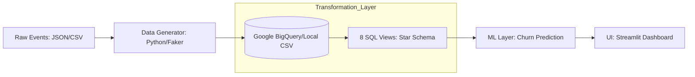
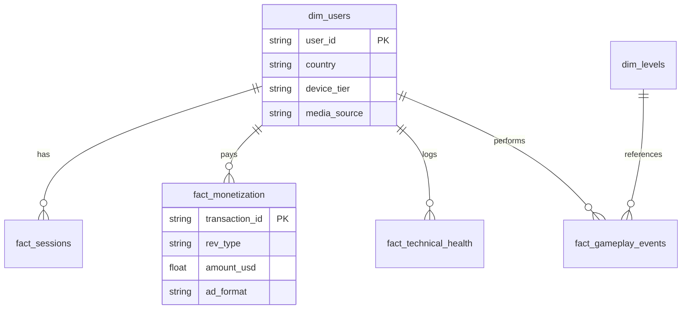

# 🎮 Mobile Game Analytics Portal: End-to-End ELT Pipeline

[](https://game-analytics-rabbit.streamlit.app/)
[](https://www.python.org/)
[](https://opensource.org/licenses/MIT)

<p align="center">
  <b><a href="#-english-version">ENGLISH VERSION</a></b> |
  <b><a href="#-phiên-bản-tiếng-việt">PHIÊN BẢN TIẾNG VIỆT</a></b>
</p>

---

<a name="-english-version"></a>
# English Version

## 📌 1. Project Overview

This project simulates a comprehensive data analytics system for a mobile RPG game operating across **10 countries**. It demonstrates the complete workflow of a **Data Analyst/Engineer**: from designing event tracking logs and building a Data Warehouse to delivering **Diagnostic** and **Predictive** insights to optimize product performance.

## 📂 2. Project Structure

```bash
game-analytics/
├── data/                      # Simulated Datasets (Fact & Dimension tables)
│   ├── dim_users.csv
│   ├── fact_sessions.csv
│   ├── fact_monetization.csv
│   └── ...
├── models/
│   └── churn_model.pkl        # Pre-trained Random Forest model for Churn Prediction
├── scripts/
│   └── data_generator.py      # Python script using Faker to generate mock data
├── streamlit_app/             # Dashboard Source Code
│   ├── home.py                # Entry Point
│   ├── data_utils.py          # Data Loading, Caching & ML Inference Logic
│   ├── chart_factory.py       # Visualization Library (Plotly/Matplotlib styling)
│   ├── config.py              # UI Configuration (Light Mode Theme)
│   └── pages/                 # Analytical Modules
│       ├── 1_Executive_Summary.py
│       ├── 3_Engagement_Retention.py
│       ├── 4_Monetization.py
│       ├── 5_Technical_Health.py
│       ├── 6_Geographic_Trends.py
│       └── 7_Predictive_Analytics.py
├── requirements.txt           # Dependencies
└── README.md                  # Documentation

```

## 🏗 3. System Architecture

The system follows the **ELT (Extract - Load - Transform)** pattern to ensure flexibility and scalability:



## 🧠 4. Actionable Insights: Beyond Descriptive

The project focuses on translating data into action through advanced analytics:

### 🔍 Diagnostic Analytics - *Why did it happen?*

* **TikTok Drop-off:** Despite having the lowest CPI, TikTok's D1 Retention is 20% lower than Organic traffic.
* *Discovery:* First-session `duration_sec` for TikTok users is extremely low.
* *Conclusion:* Mismatch between ad creatives and actual gameplay.


* **Level 3 Choke-point:** Level 3 completion rate is only 40%.
* *Discovery:* 80% of `fail_reason` logs are "Out of time".
* *Conclusion:* The `difficulty_index` spikes too early, frustrating new players.


### 🔮 Predictive Analytics - *What will happen?*

* **Churn Forecasting:** Uses a **Random Forest** model to predict user attrition.
* *Prediction:* Users experiencing >2 crashes on **Low-end** devices have an 85% probability of churning within 48h.


* **Whale Identification:** Identifying potential high-spenders.
* *Prediction:* Users completing Level 5 within the first hour are 5x more likely to become **Whales**.


## 🗄 5. Data Model (Star Schema)

Optimized for analytical queries:



## 🛠 6. Deployment Guide

1. **Clone Repository:**
```bash
git clone https://github.com/kina2711/game-analytics.git
cd game-analytics

```


2. **Install Dependencies:**
```bash
pip install -r requirements.txt

```


3. **Generate Data (Mock):**
```bash
python scripts/data_generator.py

```


4. **Launch Dashboard:**
```bash
streamlit run streamlit_app/home.py

```


---

<a name="-phiên-bản-tiếng-việt"></a>

# Phiên bản Tiếng Việt

## 📌 1. Tổng quan dự án

Dự án này xây dựng một hệ thống phân tích dữ liệu toàn diện cho một tựa game mobile phát hành trên quy mô **10 quốc gia**. Hệ thống mô phỏng trọn vẹn quy trình của một **Data Analyst** thực thụ: từ việc thiết kế kịch bản log (Event Tracking), xây dựng kho dữ liệu (Data Warehouse), cho đến việc đưa ra các phân tích **Chẩn đoán (Diagnostic)** và **Dự báo (Predictive)** nhằm tối ưu hóa sản phẩm.

## 📂 2. Cấu trúc thư mục (Project Structure)

```bash
game-analytics/
├── data/                      # Dữ liệu giả lập (Fact & Dimension tables)
│   ├── dim_users.csv
│   ├── fact_sessions.csv
│   ├── fact_monetization.csv
│   └── ...
├── models/
│   └── churn_model.pkl        # Model Random Forest dự báo Churn
├── scripts/
│   └── data_generator.py      # Script tạo dữ liệu giả lập (sử dụng thư viện Faker)
├── streamlit_app/             # Mã nguồn ứng dụng Dashboard
│   ├── home.py                # Trang chủ (Entry point)
│   ├── data_utils.py          # Xử lý dữ liệu, Caching & Load Model
│   ├── chart_factory.py       # Thư viện vẽ biểu đồ & Style (Plotly)
│   ├── config.py              # Cấu hình giao diện (Light Mode)
│   └── pages/                 # Các trang phân tích chi tiết
│       ├── 1_Executive_Summary.py
│       ├── 3_Engagement_Retention.py
│       ├── 4_Monetization.py
│       ├── 5_Technical_Health.py
│       ├── 6_Geographic_Trends.py
│       └── 7_Predictive_Analytics.py
├── requirements.txt           # Các thư viện Python cần thiết
└── README.md                  # Tài liệu dự án

```

## 🏗 3. Kiến trúc hệ thống

Hệ thống tuân thủ mô hình **ELT (Extract - Load - Transform)** để đảm bảo tính linh hoạt và khả năng mở rộng:


## 🧠 4. Actionable Insights: Beyond Descriptive

Dự án tập trung vào việc chuyển hóa dữ liệu thành hành động thông qua hai cấp độ phân tích nâng cao:

### 🔍 Phân tích Chẩn đoán (Diagnostic Analytics) - *Tại sao điều đó xảy ra?*

* **TikTok Drop-off:** Mặc dù TikTok có CPI thấp nhất, nhưng Retention D1 thấp hơn 20% so với Organic.
* *Phát hiện:* `duration_sec` phiên đầu của user TikTok cực thấp.
* *Kết luận:* Sai lệch kỳ vọng giữa nội dung quảng cáo (Creative) và gameplay thực tế.


* **Level 3 Choke-point:** Tỷ lệ hoàn thành Level 3 chỉ đạt 40%.
* *Phát hiện:* 80% `fail_reason` là "Out of time".
* *Kết luận:* Chỉ số `difficulty_index` tăng vọt khiến người chơi nản lòng.


### 🔮 Phân tích Dự báo (Predictive Analytics) - *Điều gì sẽ xảy ra?*

* **Churn Forecasting:** Sử dụng mô hình **Random Forest** để dự báo xác suất người chơi rời bỏ.
* *Dự báo:* User gặp > 2 lần `is_crash` trên thiết bị **Low-end** có 85% xác suất Churn trong 48h.


* **Whale Identification:** Nhận diện người nạp tiền tiềm năng.
* *Dự báo:* User hoàn thành Level 5 trong < 1 giờ đầu có khả năng trở thành **Whale** cao gấp 5 lần.


## 🗄 5. Mô hình dữ liệu (Star Schema)

Dữ liệu được tổ chức theo mô hình Star Schema để tối ưu hóa hiệu suất truy vấn Dashboard:

* **Fact Tables:** `fact_sessions`, `fact_monetization`, `fact_gameplay_events`, `fact_technical_health`.
* **Dimension Tables:** `dim_users`, `dim_levels`, `dim_dates`.

## 🛠 6. Hướng dẫn vận hành

1. **Clone dự án:**
```bash
git clone [https://github.com/kina2711/game-analytics.git](https://github.com/kina2711/game-analytics.git)
cd game-analytics

```


2. **Cài đặt thư viện:**
```bash
pip install -r requirements.txt

```


3. **Khởi tạo dữ liệu (Mock Story):**
```bash
python scripts/data_generator.py

```


4. **Chạy Dashboard:**
```bash
streamlit run streamlit_app/home.py

```


---

## 👤 Author

**Thái Trung Kiên (Rabbit)**

* **Role:** Data Analyst, Analytics Engineer.
* **Focus:** Mobile Game Analytics, ETL Pipelines, User Behavior Modeling.
